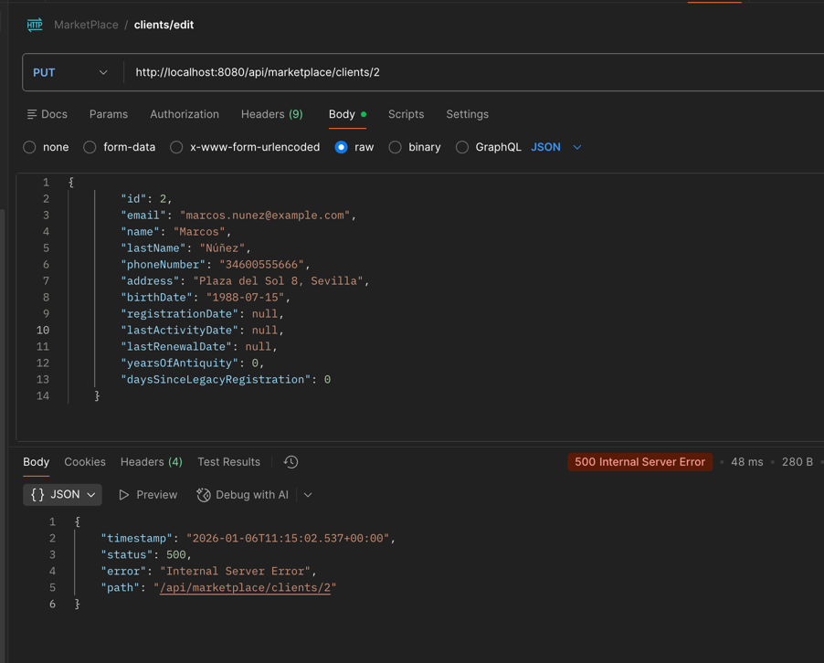
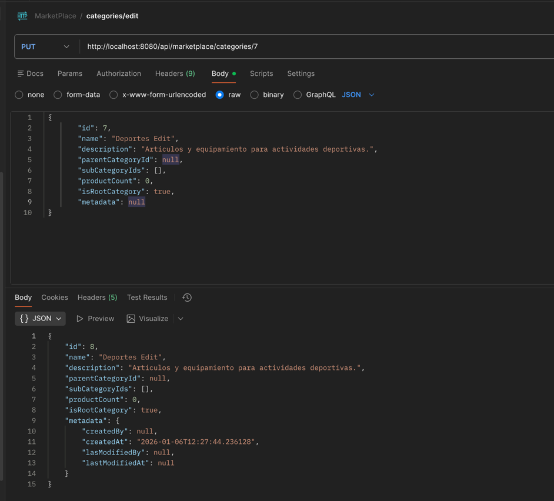
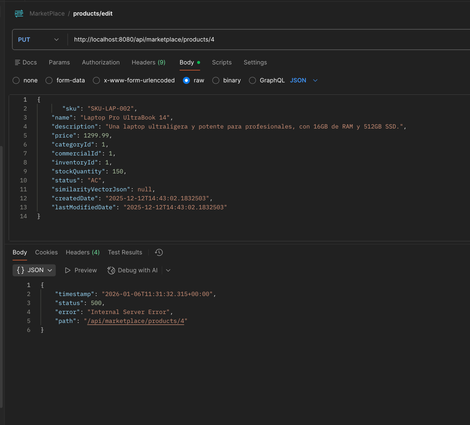
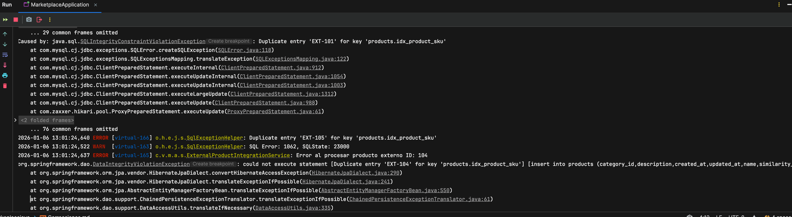

## 📖 Cliente
Cuando coloco un id de cliente no existente para editar me envia un starus 500 y la respuesta es esta:

```bash
{
"timestamp": "2026-01-06T11:09:37.233+00:00",
"status": 500,
"error": "Internal Server Error",
"path": "/api/marketplace/clients/4"
}
```


## 📖 Categoria
 hay un error al editar categoria, no esta editando, esta creando otra categoiria:
 

## 📖 Products
 Editar productos esta mal con un status 500 revisar 
 

## 📖 Products External
Se debe validar que una vez que este ejecutado, no se puede ejecutar o controlar los errores, por consola sale:


## 📖 Codigo a mejorar
En OrderJPAAdapter en vez de usar IF:

```bash
  @Override
    @Transactional
    public OrderDomain save(OrderDomain orderDomain) {
        if (orderDomain.id() == null) {
            return createNewOrder(orderDomain);
        } else {
            return updateExistingOrder(orderDomain);
        }
    }
```

### podrias usar operador ternario, estas serian los tres ejemplos de como implementarlo:
 La versión directa con ternario (clara y concisa):
```bash
@Override
@Transactional
public OrderDomain save(OrderDomain orderDomain) {
    return (orderDomain.id() == null)
        ? createNewOrder(orderDomain)
        : updateExistingOrder(orderDomain);
}
```
Con comprobación de null del parámetro (más robusta):
```bash
@Override
@Transactional
public OrderDomain save(OrderDomain orderDomain) {
    Objects.requireNonNull(orderDomain, "orderDomain must not be null");
    return Objects.isNull(orderDomain.id())
        ? createNewOrder(orderDomain)
        : updateExistingOrder(orderDomain);
}
```
Si quieres estilo funcional (opcional, menos claro en este caso):
```bash
@Override
@Transactional
public OrderDomain save(OrderDomain orderDomain) {
    return Optional.ofNullable(orderDomain)
        .map(od -> od.id() == null ? createNewOrder(od) : updateExistingOrder(od))
        .orElseThrow(() -> new IllegalArgumentException("orderDomain must not be null"));
}
```
### Mejoras en los textos estaticos
El texto estatico debe estar en una clase constants, por lo menos lo de los codigo que contenga mucho texto. 
```bash
public record CommercialRequestDTO(
@NotNull(message = "El precio base es obligatorio.")
@DecimalMin(value = "0.0", inclusive = false, message = "El precio base debe ser mayor que cero.")
BigDecimal basePrice,

        @NotNull(message = "La tasa de impuesto es obligatoria.")
        @DecimalMin(value = "0.0", message = "La tasa de impuesto no puede ser negativa.")
        BigDecimal taxRate
) {
}
```
### sugerencia de mejora de codigo
se puede mejorar le record InventoryCsvDTO:
```bash
public static Optional<InventoryCsvDTO> fromCsvRow(String[] row, int rowNum) {
if (row == null || row.length < 3) {
log.warn("Fila de inventario #{} ignorada: número de columnas insuficiente (esperado: 3, encontrado: {}).", rowNum, row != null ? row.length : 0);
return Optional.empty();
}

        try {
            Long productId = Long.parseLong(row[0].trim());
            int currentStock = Integer.parseInt(row[1].trim());
            String warehouseLocation = row[2].trim();

            if (currentStock < 0) {
                log.warn("Fila de inventario #{} ignorada: el stock '{}' no puede ser negativo.", rowNum, currentStock);
                return Optional.empty();
            }

            return Optional.of(new InventoryCsvDTO(productId, currentStock, warehouseLocation));

        } catch (NumberFormatException e) {
            log.error("Fila de inventario #{} ignorada: error al parsear un número. productId='{}', currentStock='{}'.", rowNum, row[0], row[1], e);
            return Optional.empty();
        } catch (Exception e) {
            log.error("Fila de inventario #{} ignorada: error inesperado al procesar la fila.", rowNum, e);
            return Optional.empty();
        }
    }
```
podria hacerse algo asi, mas legible:
```bash
public static Optional<InventoryCsvDTO> fromCsvRow(String[] row, int rowNum) {

    return Optional.ofNullable(row)
        .filter(r -> {
            boolean valid = r.length >= 3;
            if (!valid) {
                log.warn(
                    "Fila de inventario #{} ignorada: número de columnas insuficiente (esperado: 3, encontrado: {}).",
                    rowNum, r.length
                );
            }
            return valid;
        })
        .flatMap(r -> parseLong(r[0], rowNum, "productId"))
        .flatMap(productId ->
            parseInt(row[1], rowNum, "currentStock")
                .filter(stock -> {
                    boolean valid = stock >= 0;
                    if (!valid) {
                        log.warn(
                            "Fila de inventario #{} ignorada: el stock '{}' no puede ser negativo.",
                            rowNum, stock
                        );
                    }
                    return valid;
                })
                .map(stock -> new InventoryCsvDTO(productId, stock, r[2].trim()))
        );
}

```
 con estos Métodos auxiliares funcionales (clave de la mejora)
```bash
private static Optional<Long> parseLong(String value, int rowNum, String fieldName) {
    return Optional.ofNullable(value)
        .map(String::trim)
        .flatMap(v -> {
            try {
                return Optional.of(Long.parseLong(v));
            } catch (NumberFormatException e) {
                log.error(
                    "Fila de inventario #{} ignorada: error al parsear {}='{}'.",
                    rowNum, fieldName, v, e
                );
                return Optional.empty();
            }
        });
}

private static Optional<Integer> parseInt(String value, int rowNum, String fieldName) {
    return Optional.ofNullable(value)
        .map(String::trim)
        .flatMap(v -> {
            try {
                return Optional.of(Integer.parseInt(v));
            } catch (NumberFormatException e) {
                log.error(
                    "Fila de inventario #{} ignorada: error al parsear {}='{}'.",
                    rowNum, fieldName, v, e
                );
                return Optional.empty();
            }
        });
}

```
Evitar el uso de muchos for es decir for anidados :
```bash
// Llenar datos
int rowNum = 1;
for (T item : data) {
  Row row = sheet.createRow(rowNum++);
    for (int i = 0; i < mappers.size(); i++) {
      row.createCell(i).setCellValue(mappers.get(i).apply(item));
    }
}
```

usar mejor:
```bash
// Llenar datos
IntStream.range(0, data.size())
    .forEach(rowIndex -> {
        Row row = sheet.createRow(rowIndex + 1);
        T item = data.get(rowIndex);

        IntStream.range(0, mappers.size())
            .forEach(colIndex ->
                row.createCell(colIndex)
                   .setCellValue(mappers.get(colIndex).apply(item))
            );
    });

```

```bash
// Datos
for (T item : data) {
  for (Function<T, String> mapper : mappers) {
    table.addCell(mapper.apply(item));
  }
}
```
mejor usar:
```bash
// Datos
data.forEach(item ->
    mappers.forEach(mapper ->
        table.addCell(mapper.apply(item))
    )
);
```

 en casos como estos:
```bash
@Override
@Transactional(readOnly = true)
public ClientStatsDTO getClientStats(Long clientId) {
ClientDomain clientDomain = clientPersistencePort.findById(clientId)
.orElseThrow(() -> new ClientNotFoundException(clientId));

        // Asumiendo que estos métodos existen en tu ClientDomain
        long yearsOfAntiquity = clientDomain.getYearsOfAntiquity();
        long daysSinceLegacyRegistration = clientDomain.getDaysSinceLegacyRegistration();

        return new ClientStatsDTO(clientId, yearsOfAntiquity, daysSinceLegacyRegistration);
    }
```

 mejor hacer directo sin crear variables adicionales:

```bash
@Override
@Transactional(readOnly = true)
public ClientStatsDTO getClientStats(Long clientId) {
ClientDomain clientDomain = clientPersistencePort.findById(clientId)
.orElseThrow(() -> new ClientNotFoundException(clientId));
        return new ClientStatsDTO(clientId, clientDomain.getYearsOfAntiquity(), clientDomain.getDaysSinceLegacyRegistration());
    }
```

 hay services que tienen el transaccional, por ejemplo ClientServiceImpl:
 ```bash
 @Override
 @Transactional(readOnly = true)
 public List<ClientDTO> findAll() {
    List<ClientDomain> clients = clientPersistencePort.findAll();
    return clientMapper.toDtoList(clients);
 }
```
 pero en realidad no hacen transacciones, son services, que llaman el port (clientPersistencePort)
 y en los adapter es que se hace la transaccion, corregir esto por favor, ya que no hay en el adpater el transaccion.
```bash
Component
@RequiredArgsConstructor
public class ClientJPAAdapter implements ClientPersistencePort {

    private final ClientRepository clientRepository;
    private final ClientMapper clientMapper;

    @Override
    public ClientDomain save(ClientDomain client) {

        Client entityToSave = clientMapper.toEntity(client);

        Client savedEntity = clientRepository.save(entityToSave);

        return clientMapper.toDomain(savedEntity);
    }

    @Override
    public Optional<ClientDomain> findById(Long id) {
        return clientRepository.findById(id)
                .map(clientMapper::toDomain);
    }
 ```
 ### el metodo se puede hacer mejor, sobre todo evitar el usuo de tantos if
 ```bash
 @Override
 @Transactional
 public ImportResultDTO importFromCsv(InputStream inputStream) {
   // resto del codigo
   for (int i = 0; i < clientCsvDtos.size(); i++) {
                ClientCsvDTO dto = clientCsvDtos.get(i);
                int rowNum = i + 2;

                if (dto.getEmail() == null || dto.getEmail().isBlank()) {
                    errors.add("Fila " + rowNum + ": El email es obligatorio.");
                    continue;
                }
                if (existingEmails.contains(dto.getEmail())) {
                    errors.add("Fila " + rowNum + ": El email '" + dto.getEmail() + "' ya está registrado.");
                    continue;
                }


                clientsToSave.add(clientMapper.fromCsvDtoToDomain(dto));
                existingEmails.add(dto.getEmail());
            }
   // mas codigo         
 }
 ```
### se podria mejorar de esta manera, el uso del codigo anterior :

Representar el índice de fila con IntStream
 ```bash
IntStream.range(0, clientCsvDtos.size())
    .forEach(i -> processCsvRow(
        clientCsvDtos.get(i),
        i + 2,
        existingEmails,
        clientsToSave,
        errors
    ));

 ```
Extraer la lógica en un método funcional
```bash
private void processCsvRow(
        ClientCsvDTO dto,
        int rowNum,
        Set<String> existingEmails,
        List<ClientDomain> clientsToSave,
        List<String> errors
) {

    Optional.ofNullable(dto.getEmail())
        .map(String::trim)
        .filter(email -> !email.isBlank())
        .filter(email -> {
            if (existingEmails.contains(email)) {
                errors.add(
                    "Fila " + rowNum + ": El email '" + email + "' ya está registrado."
                );
                return false;
            }
            return true;
        })
        .ifPresentOrElse(
            email -> {
                clientsToSave.add(clientMapper.fromCsvDtoToDomain(dto));
                existingEmails.add(email);
            },
            () -> {
                if (dto.getEmail() == null || dto.getEmail().isBlank()) {
                    errors.add("Fila " + rowNum + ": El email es obligatorio.");
                }
            }
        );
}
 ```
 ##  categoryservice codigos a mejorar
```bash
if (!Objects.equals(newParentId, currentParentId)) {
    if (newParentId != null) {
        if (newParentId.equals(id)) {
            throw new CategoryCycleException(id, newParentId, UNA_CATEGORÍA_NO_PUEDE_SER_SU_PROPIO_PADRE);
        }

        validateCycles(id, newParentId);
    }
}

```
Problemas:
-  
- La intención no es inmediata
- Difícil de extender (más reglas ⇒ más if)
- Lógica de negocio poco expresiva


### Solucion con Versión funcional con Optional (limpia y elegante)
```bash
if (!Objects.equals(newParentId, currentParentId)) {
    Optional.ofNullable(newParentId)
        .ifPresent(parentId -> {
            if (parentId.equals(id)) {
                throw new CategoryCycleException(
                    id,
                    parentId,
                    UNA_CATEGORÍA_NO_PUEDE_SER_SU_PROPIO_PADRE
                );
            }
            validateCycles(id, parentId);
        });
}
```
### Solucion con Guard clauses con early return (más limpia aún)
```bash
if (Objects.equals(newParentId, currentParentId)) {
    return categoryMapper.toDto(existingDomain);
}

if (newParentId == null) {
    // Padre eliminado, nada que validar
} else {
    if (newParentId.equals(id)) {
        throw new CategoryCycleException(
            id,
            newParentId,
            UNA_CATEGORÍA_NO_PUEDE_SER_SU_PROPIO_PADRE
        );
    }
    validateCycles(id, newParentId);
}
```

 ### mejorar este codigo de categoryServiceImpl
```bash
for (int i = 0; i < csvDtoList.size(); i++) {
CategoryCsvDTO dto = csvDtoList.get(i);
int rowNum = i + 2;

                if (dto.getName() == null || dto.getName().isBlank()) {
                    errors.add("Fila " + rowNum + ": El nombre de la categoría es obligatorio.");
                    continue;
                }

                if (existingNames.contains(dto.getName())) {
                    errors.add("Fila " + rowNum + ": La categoría '" + dto.getName() + "' ya existe.");
                    continue;
                }

                if (dto.getParentCategoryId() != null && !existingIds.contains(dto.getParentCategoryId())) {
                    errors.add("Fila " + rowNum + ": La categoría padre con ID '" + dto.getParentCategoryId() + "' no existe.");
                    continue;
                }

                CategoryDomain newDomain = categoryMapper.fromCsvToDomain(dto);
                categoriesToCreate.add(newDomain);
                existingNames.add(newDomain.name());
            }
```
Las Excepciones todas en un mismo sitio por favor.
